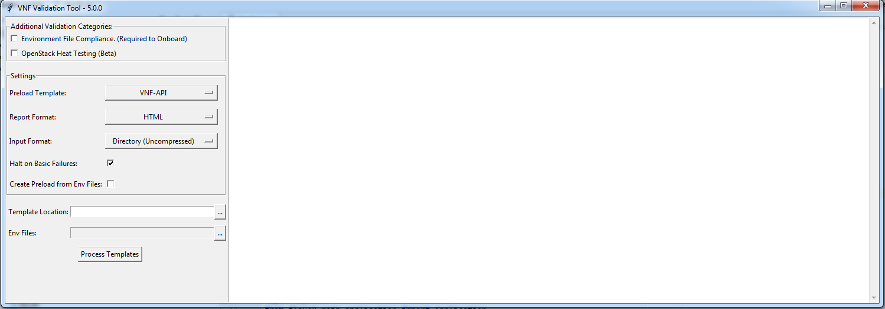

.. This work is licensed under a Creative Commons Attribution 4.0 International License.
.. http://creativecommons.org/licenses/by/4.0
.. Copyright 2019 AT&T Intellectual Property.  All rights reserved.

Graphical User Interface
========================

If desired, a graphical user interface is also provided when the application
has been :doc:`installed from source <installation>`.  This can provide a
convenient wrapper that enables users to perform validations without using
extensive command-line usage.

At this time the application can only be run from source, but in the future
a packaged version may be provided.

How to Start the Application
----------------------------

1.  Ensure you have installed the application and its dependencies from
    source as described in the :doc:`Installation chapter <installation>`

2.  Navigate to the ``ice_validator`` directory::

    > cd <vvp-directory>/ice_validator

3.  Launch the gui using the ``vvp.py`` command::

    > python vvp.py

How to Use the Tool
-------------------

.. note::
    The look-and-feel of the application will vary slightly depending
    on the Operating System of the host machine.  The screenshot below is how
    the application looks on a Windows machine.

**Sample Screenshot of VVP GUI Application**

All configuration options available to the command-line version of the
application are exposed as options on the left-hand side of the GUI.

Additional Validation Categories
~~~~~~~~~~~~~~~~~~~~~~~~~~~~~~~~

This allows the base set of tests to be extended by selecting additional
categories of tests.  At this time, only one additional category is supported.

This maps to the ``--category`` command-line option.

+----------------------+-------------------------------------------------------+
| Category             | Description                                           |
+======================+=======================================================+
| Environment          | When selected, VVP will flag parameters in environment|
| File Compliance      | files that should be excluded per the ONAP Heat       |
|                      | requirements.  De-selecting this can be useful when   |
|                      | when testing instantiation directly in OpenStack      |
|                      | without ONAP orchestration.  This is equivalent to    |
|                      | specifying ``--category=environment_file`` from the   |
|                      | command-line.                                         |
+----------------------+-------------------------------------------------------+
| OpenStack Heat       | When selected, will validate the Heat templates are   |
| Testing              | valid per OpenStack specifications (using the         |
|                      | latest version of OpenStack available). If not        |
|                      | selected, then VVP will only validate that the Heat   |
|                      | is compliant with ONAP rules.                         |
+----------------------+-------------------------------------------------------+

Settings
~~~~~~~~

**Preload Template** - Determines the format of the preload template that will
be generated by VVP. The preload template can be completed to load per-instance
values into SDNC.  This allows the SDC model to be generic and re-used across
environments.  There are currently two formats supported by ONAP (VNF-API and
GR-API)

**Report Format** - Controls the format of the output report generated after
validation.  The options are: HTML (the default), Excel, and CSV.  This is
equivalent the ``--report-format`` command-line option with the exception,
that the JSON format is not supported via the GUI.

**Input Format** - Controls the expected format of the template files.  This
can either be a ZIP file containing the Heat templates or a directory
containing the Heat templates.  There is no ZIP file option for the command-line
script at this time.

**Halt on Basic Failures** - VVP deems certain tests as "base tests" which if
failed have the potential to generate a large number of other errors. This
would include tests such as validating that the Heat templates are valid
YAML.  If checked, the tool will immediately stop all other tests and show
a report of this single failure. This can be useful in reducing the number
of errors to sift through in these situations.  De-selecting this option
is the equivalent of specifying ``--continue-on-failure`` as a command-line option.

**Create Preloads from Env Files** - When selected, the Env Files file selection
box will be enabled allow the user to select a directory of .env file definitions
that can be used to populate a preload template.  See
:ref:`Preload Generation <vvp-preload-gen>` for more details

Running Validations
~~~~~~~~~~~~~~~~~~~

1. Select the desired preload format (VNF-API or GR-API)
2. Select the desired input format in the settings (ZIP or Directory)
3. Select the [...] button next to the Template Location input box
4. Select the directory or ZIP file containing the Heat templates, and then
   click Open
5. Once the input is selected, select the "Validate Templates" button to
   start the validation process.  The white box to the right will
   display output as the validations are executed.
6. Once validation is complete a summary of pass and fail will be written
   to the output window, and a "View Report" option will appear on the
   left-hand control panel.
7. Select the "View Report" option, and the report will be opened in the
   the appropriate application based on report format.
8. If you have questions about report output, please refer to the
   :ref:`Validation Report reference material <vvp-report>` for more
   information.

Customizing the GUI
-------------------

The VVP GUI offers an ONAP Operator a number of ways to configure the GUI text
and behavior via a configuration file called ``vvp-config.yaml`` located in
the ``ice_validator`` directory. Customizing the GUI would require packaging
the VVP GUI with a modified configuration file.

Basic Customizations
~~~~~~~~~~~~~~~~~~~~

This section will cover what the standard configurations that can tweak the
display and options displayed in the default GUI.

Here is a sample of the current configuration file.  Please note that some of
these settings may not be used in the default ONAP configuration.

.. code-block:: yaml

    namespace: org.onap.vvp
    owner: ONAP
    ui:
      app-name: VNF Validation Tool
      disclaimer-text: This is a legal disclaimer in the footer
      requirement-link-text: ONAP VNF Heat Requirements (master)
      requirement-link-url: https://onap.readthedocs.io/en/latest/submodules/vnfrqts/requirements.git/docs/Chapter5/Heat/index.html
    categories:
      - name: Environment File Compliance. (Required to Onboard)
        category: environment_file
        description:
          Checks certain parameters are excluded from the .env file, per HOT Requirements.
          Required for ASDC onboarding, not needed for manual Openstack testing.
      - name: OpenStack Heat Testing (Beta)
        category: openstack
        description:
          Uses the latest OpenStack Heat community version available to validate that
          a heat template is valid OpenStack Heat. This testing is equivalent to using
          heat template-validate from the command line.
    settings:
      polling-freqency: 1000
      default-verbosity: Standard

*Available Configuration Settings*

* ``namespace`` (**required**)
    * **Use**: Users prior selections in the GUI are saved in an
      OS-specific application directory for per user settings.  This namespace
      is used to segregate these cached settings from other versions of the
      validation tool
    * **When to Modify**: If you are packaging a new version of the application,
      then this field should be changed to ensure a user running the standard
      ONAP version **and** your custom version do not encounter conflicts in
      saved settings.

* ``owner`` (**required**)

    * **Use**: Similar to ``namespace`` this is used to segregate the cached
      application setting selections.
    * **When to Modify**: If you are packaging a new version of the application,
      then this field should be changed to ensure a user running the standard
      ONAP version **and** your custom version do not encounter conflicts in
      saved settings.

* ``ui.app-name``: (**optional** - Default is VNF Validation Tool)

    * **Use**: Controls the name of the application displayed in the title bar
    * **When to Modify**: When you want the application to display a different
      name. Please note that the version is displayed from the ``version.py``
      file and will be displayed in the title bar regardless of this fields
      setting.

* ``ui.disclaimer-text``: (**optional** - no disclaimer footer if omitted)

    * **Use**: If present the text will be displayed as a message in the footer
      of the application.  At some point this text may also be included on the
      footer of the reports as well.
    * **When to Modify**: Provide this if you need to provide any persistent
      messaging to your users such as a legal disclaimer (not currently used
      by ONAP)

* ``ui.requirement-text``: (**optional** - no requirement link in footer if omitted)

    * **Use**: If present this will describe the requirements that are validated
      by the validation tool prepended by the word "Validating:".  Example:
      Validating: ONAP VNF Provider Heat Requirements (master)
    * **When to Modify**: If you have modified or extended the tests and you
      want the GUI to reference a different document than the ONAP requirements.
      Alternatively you can remove the setting and not show link to the
      requirements in the footer.

* ``ui.requirement-url``: (**optional** - no requirement link in footer if omitted)

    * **Use**: If present this will be the link to the requirement text.  It should
      be a full URL with protocol (ex: http://url.com ).
    * **When to Modify**: If you have modified or extended the tests and you want
      the GUI to reference a different document than the ONAP requirements.
      Alternatively you can remove the setting and not show link to the requirements
      in the footer.

* ``categories``: (**optional**)

    * **Use**: This section allows operators to customize the validation categories
      that can be selected by the end users.  Individual tests can be decorated
      with the ``category`` decorator to mark them as distinct categories of tests.
      These tests will **not** be executed unless they are specifically requested
      using the ``--category`` command line option.

    * **When to Modify**: If you have packaged additional test cases under the
      ``ice_validator/tests`` directory with ``category`` decorators, then you
      can define them in this section to make them accessible via the GUI.

    * **Fields**:

        * ``name``: Descriptive name to display to the user
        * ``category``: Name used in the ``category`` decorator
        * ``description``: Additional help text that will displayed upon
          hovering over the label in the GUI

* ``settings.polling-frequency``: (**optional** - default is 1 second)

    * **Use**: The validations are run in a separate process.  This setting defines
      how frequently (in milliseconds) the GUI is updated from the background process.
    * **When to Modify**: It's unlikely this would need to be modified, but this
      could be tweaked to change the frequency of update if there are performance or
      latency concerns

* ``settings.default-verbosity``: (**optional** - default is Standard)

    * **Use**: Controls the default level of verbosity in the pytest output.
    * **When to Modify**: Change this if you want to increase or decrease the
      default level of verbosity.  Please note that once the user changes this
      setting, then the GUI will use the users last selection over this value.
    * **Available Value**:

        * ``Less`` - corresponds to pytest's non verbose option
        * ``Standard`` - corresponds to pytest's ``-v`` option
        * ``More`` - corresponds to pytest's ``-vv`` option

Enabling Terms and Conditions Acceptance
~~~~~~~~~~~~~~~~~~~~~~~~~~~~~~~~~~~~~~~~

There may be scenarios where an ONAP Operator wishes to gather end user
approval or consent to specific terms prior to allowing the end user to
use the validation tool.  This could be in the form of an End User License
Agreement, Terms and Conditions, or some other artifact.

This is also enabled through the ``vvp-config.yaml``.  This is configured
by defining a ``terms`` section in the file as follows:

.. code-block:: yaml

    terms:
        version: <version of terms being accepted>
        path: <relative path or url to the terms>
        popup-link-text: <message for link to terms>
        popup-msg-text: <message in the main body of the pop-up>
        popup-title: <text displayed in the title bar of pop-up dialog>

When this is enabled, a pop-up will be displayed blocking the users progress
until the terms are reviewed (link clicked), and either accepted or declined.

If the user accepts, then their acceptance of **version** of the terms
will be recorded and they will not need to re-accept unless the version is
changed.

If the user declines, then the validation tool will immediately exit.

.. image:: vvp-with-terms.png

The actual terms and conditions will be opened in the user's default browser.
The path can be a local file path or an HTTP URL.  If you wish for the content
to be rendered in the browser, then it is recommended that the content be
stored as HTML.
